# AI-Native STDD × VDD Governance System

[](https://github.com/trionnemesis/AI-NativeSTDD-VDD/actions/workflows/governance-shadow.yml)
[](governance/manifest.yaml)
[](requirements-governance.txt)
[](LICENSE)

> **AI-Native STDD × VDD** is a machine-readable governance shadow for agentic software delivery: enforce a fixed five-gate pipeline, keep test and implementation authority separated, and require evidence — not model output or a green CI run alone — before anything gets called verified.

This repository gives Claude Code-ready governance templates and a machine-readable shadow of an AI-native Specification & Test-Driven Development / Verification & Validation-Driven Development (STDD × VDD) methodology, for teams whose agentic delivery is exposed to fake-green or self-certifying tests, spec drift that silently fans out across specs/BDD/UI/API/tests, and uncontrolled self-healing CI that quietly masks real regressions.

It enforces a fixed five-gate pipeline (`GATE:SPEC → GATE:RED → GATE:GREEN → GATE:VDD → GATE:DEPLOY`), strict role separation between test and implementation agents, and evidence-based sign-off. The methodology's canonical authority remains the linked Notion workspace; this repository is currently a **non-authoritative shadow** of it, and it deliberately does not promise unsupervised, fully autonomous delivery.

[繁體中文說明](./README.zh-TW.md) · [Governance shadow](governance/README.md) · [Notion canonical root](https://www.notion.so/AI-Native-STDD-VDD-382f5b2d1a9081e9a972f0b33fad3142) · [Agent setup protocol](setup/AGENT_SETUP_PROTOCOL.md)

## Contents

- [Why](#why)
- [How it works](#how-it-works)
- [What it does](#what-it-does)
- [Authority and trust boundaries](#authority-and-trust-boundaries)
- [Install](#install)
- [Example prompts](#example-prompts)
- [Current status](#current-status)
- [Repository map](#repository-map)
- [Research and design](#research-and-design)
- [FAQ](#faq)
- [Related projects](#related-projects)

## Why

AI can already produce a working feature from a specification, but agentic delivery keeps running into three sources of drift:

1. A requirement change fans out across Spec, BDD, UI, API, tests, and quality docs at the same time, and the fan-out is hard to trace.
2. Agents can generate tests that pass on the surface without actually verifying the requirement — fake or self-certifying tests.
3. Environment and UI drift turns CI red; an uncontrolled self-healing loop can then push it back to green and quietly mask a real regression.

This system uses a Canonical Spec, verifiable tests, machine-checkable gates, role isolation, and production evidence so a human can see why a change was allowed, why it was blocked, and who owns the decision. It does not promise unsupervised, fully autonomous development.

## How it works

Two things are load-bearing:

- **Canonical Glossary + Stable IDs** — one fact is defined exactly once; every other document references it by ID instead of redefining it.
- **A fixed five-gate pipeline**, framed by the delivery flow below.

```text
Signal → GATE:ADMIT → Change Intent
  → Delta Spec → Impact Analysis → GATE:SPEC
  → Independent Test Generation → GATE:RED
  → AI Implementation → GATE:GREEN
  → Quality Verification → GATE:VDD
  → Traceability Generation → Controlled Deployment → GATE:DEPLOY
  → Production Verification → Signal / Accepted Evidence
```

[`07｜End-to-end execution flow and rollout checklist`](https://app.notion.com/p/382f5b2d1a9081ea8de4d42a6f8bdabc) is the single canonical 12-step / 5-gate sequence. The frozen pipeline is only:

```text
GATE:SPEC → GATE:RED → GATE:GREEN → GATE:VDD → GATE:DEPLOY
```

The text sequence above is the canonical citation source; the diagram below is the same flow, for a quick visual scan only:

```mermaid
flowchart LR
    Signal([Signal]) --> ADMIT[GATE:ADMIT]
    ADMIT --> Intent[Change Intent]
    Intent --> DeltaSpec[Delta Spec]
    DeltaSpec --> Impact[Impact Analysis]
    Impact --> SPEC{{GATE:SPEC}}
    SPEC --> TestGen[Independent Test Generation]
    TestGen --> RED{{GATE:RED}}
    RED --> Impl[AI Implementation]
    Impl --> GREEN{{GATE:GREEN}}
    GREEN --> QV[Quality Verification]
    QV --> VDD{{GATE:VDD}}
    VDD --> Trace[Traceability Generation]
    Trace --> Deploy[Controlled Deployment]
    Deploy --> DEPLOY{{GATE:DEPLOY}}
    DEPLOY --> ProdVerify[Production Verification]
    ProdVerify --> Evidence([Signal / Accepted Evidence])

    classDef gate fill:#f9d976,stroke:#b8860b,color:#000;
    class SPEC,RED,GREEN,VDD,DEPLOY gate;
```



| Gate | Purpose and key evidence |
|---|---|
| [`GATE:ADMIT`](https://app.notion.com/p/388f5b2d1a9081789657dbfc101ca8e6) | Discovery & Dispatch, upstream of 07: signal fingerprint, deterministic dedup, non-authoritative LLM-assisted classification, tiered dispatch, and a Change Intent. It is not a sixth pipeline gate. |
| `GATE:SPEC` | Delta Spec, Impact Analysis, Stable ID, System / Change Profile, applicable BDD/UI/API/quality/release contracts, and an evidence plan. |
| `GATE:RED` | FEATURE/DEFECT changes must have a baseline failure; other change profiles need acceptable alternative evidence. The test actor may not read the new implementation solution. |
| `GATE:GREEN` | Applicable tests, static analysis, lint/type/build, and protected-test integrity must all pass. Test Impact Analysis (TIA) is only a selective-testing efficiency layer inside this gate — it cannot weaken the nightly full regression. |
| `GATE:VDD` | Verifies mutation, performance, reliability, resilience, negative-path, a11y/visual, and security/privacy/authorization evidence per profile. |
| `GATE:DEPLOY` | Release Profile, compatibility/migration, controlled rollout, observation, promotion/abort/rollback, supply-chain evidence, and a runbook. |

`GATE:REGRESSION` is the auxiliary regression gate for agent-workflow configuration: it checks prompt, model, memory, routing, tool-policy, and guardrail changes against Golden Tasks, and does not change the order or count of the five pipeline gates.

**36-second overview:** [](docs/media/ai-native-stdd-vdd-intro.mp4) — click the animation for the narration-free 1280×720 MP4.

## What it does

Six governance principles hold the system together:

1. **One fact, one definition** — other documents cite a Stable ID instead of redefining it.
2. **Spec changes start as a Delta** — a Delta Spec is created first, then merged back into the Canonical Spec.
3. **Test and implementation authority are separated** — an implementation agent may not weaken tests, thresholds, policies, fixtures, or quarantine rules on its own.
4. **Quality gates must be measurable** — measurement location, environment, load, percentile, and threshold are all explicit.
5. **Every test must prove it can fail** — a test without Red Evidence or profile-accepted alternative evidence is not credible evidence.
6. **Production validation is not security proof** — runtime data validates operational quality assumptions; security, privacy, authorization, and compliance still need multi-source evidence.

| Role | Responsibility |
|---|---|
| Product / Domain Owner | Value, observable behavior, and domain invariants. |
| Engineering / Architecture | Boundaries, compatibility, migration, and recoverability. |
| QA / Verification | Test oracle, Red Evidence, and semantic-weakening review. |
| SRE / Platform | SLOs, release, observation, rollback, and incident handling. |
| Security / Privacy | Data classification, authorization, supply chain, waivers, and incident adjudication. |
| Agent | Drafts, deterministic checks, PRs, and evidence within already-approved boundaries only — never lowering its own gates, approving its own exceptions, rewriting its own security rules, or merging directly. |

| Autonomy tier | Canonical dispatch boundary |
|---|---|
| **T1** | Low-severity `dependency_patch`, `lint`, or `doc_drift` may auto-dispatch and propose a PR; still requires worktree attestation, and direct merge stays restricted. |
| **T2** (default) | May auto-dispatch and open a draft PR, but needs human review; anything not clearly T1 or T3 falls through to T2. |
| **T3** | Touches an invariant, security, or schema migration, or is high severity without deterministic evidence: a human must write the Change Intent, and auto-dispatch is disallowed. |

## Authority and trust boundaries

| Surface | Role |
|---|---|
| [Notion root page](https://www.notion.so/AI-Native-STDD-VDD-382f5b2d1a9081e9a972f0b33fad3142) | Sole authority for the Canonical Glossary, normative core, and methodology evolution. |
| [`governance/`](governance/README.md) | Machine-readable shadow of `MCR:2026:004`. |
| [`governance/manifest.yaml`](governance/manifest.yaml) | Authority state, the frozen gate order, and cutover preconditions. |
| [`generated/notion-canonical-view.md`](generated/notion-canonical-view.md) | Deterministic human view generated from the shadow; never hand-edited. |

A mismatch must never be silently resolved in the repository's favor: Notion wins, and the comparison flow must fail loudly. Something existing in this repository does not mean authority cutover or runtime enforcement has happened.

This repository, and any project that adopts its template, does **not**:

- treat a hook file's existence as proof of `runtime_enforced` — that also requires registration, the execution point, the target path policy, and re-runnable evidence to all pass Confirm Mode together;
- allow authority cutover, waiver approval, break-glass approval, deployment, or merge without an explicit human decision, unless the current contract states otherwise;
- allow a Stable ID to be silently reused or redefined;
- weaken test, validation, security, authorization, policy, or evidence requirements just to make a check pass;
- treat Production Telemetry as sufficient proof of security, privacy, authorization, or compliance — those still need policy, design review, scanning, attestation, and independent adjudication.

## Install

### Apply the Claude Code template to your project

```bash
git clone https://github.com/trionnemesis/AI-NativeSTDD-VDD.git
cd AI-NativeSTDD-VDD

# Point at the project you want to add the governance layer to; this copies
# docs, the governance shadow, the generated view, and the validation script.
# P0 still requires a separate administrator step.
bash setup/init.sh /absolute/path/to/your-project
```

After init, run this in a Claude Code session inside the target project:

```text
Read setup/AGENT_SETUP_PROTOCOL.md and run Confirm Mode
```

Confirm Mode checks the manifest and gate/profile contracts first, then managed settings, `.vdd/phase`, hook scripts, hook registration, and the `red-verifier` subagent. Any failure must go through Configure Mode first; a prompt-only rule may never be claimed as runtime enforcement.

### Validate this repository

Requirements: Python `>=3.11`.

```bash
python3 -m pip install -r requirements-governance.txt
python3 scripts/governance.py validate
python3 scripts/governance.py render --check
python3 -m unittest discover -s tests -v
```

These commands validate the repository-side shadow's schema, references, render output, and regressions; they do not by themselves promote the shadow to canonical authority.

### Optional: Codex adapter

```bash
python3 scripts/codex_adapter.py validate
```

See [`integrations/codex/adapter.yaml`](integrations/codex/adapter.yaml) and [25｜Codex Adapter／Hermes Mapping Layer](docs/25-codex-adapter.md) for the opt-in Codex/Hermes lane, gate, and evidence mapping.

## Example prompts

The safe pattern is to ask an agent to load the minimum bundle and report gate/evidence state, not to assume the repository is already canonical or enforced.

```text
Read AGENTS.md and governance/manifest.yaml first.
Pick the single task bundle in AGENTS.md that matches this task, and load only
the files it lists.
Then read setup/AGENT_SETUP_PROTOCOL.md and run Confirm Mode.
Report every checklist item as pass or fail, and do not start Configure Mode
changes unless a check actually failed.
Distinguish contract_defined, configured, runtime_enforced, and verified in
your summary — do not claim runtime_enforced from a hook file's existence alone.
```

Other useful requests:

- "Validate the governance shadow and tell me which `cutover_preconditions` in `governance/manifest.yaml` are still false."
- "Show me the machine-checkable evidence `GATE:VDD` requires under the current System/Change Profile."
- "Explain why `GATE:ADMIT` and `GATE:REGRESSION` are not part of the five-gate pipeline."

## Current status

This repository is a **non-authoritative shadow** (`MCR:2026:004`), not the canonical methodology.

| Cutover precondition | State |
|---|---|
| Target repository selected / layout committed | Pass |
| Schema validation / Stable ID / reference lint | Pass |
| Five-gate conformance tests | Pass |
| Notion generation is idempotent | Pass |
| Notion ↔ repo semantic hash match | Pending |
| Rollback dry run | Pending |
| Observation window defined | Pending |
| Explicit human cutover approval | Pending |

Until every row above is `Pass` and the Methodology Warden explicitly approves cutover, Notion remains canonical and any mismatch must fail loudly rather than default to the repository.

| Adoption level | Minimum capability |
|---|---|
| **MVP** | Stable ID, Delta Spec, Red Evidence, Protected Test Guard, GREEN Stop Gate, minimal traceability. |
| **Beta** | Changed-code mutation, role isolation, Critical Journey Quality Profile, Evidence Envelope, risk-based Change Profile. |
| **Full** | Agent security boundary, progressive release, Production Observation, signed provenance, EvalOps, TIA, and controlled Self-Healing. |

Self-Healing CI sits in the operational loop outside 07: it may only propose a PR, never merge directly, and any test change must rebuild Red Evidence.

## Repository map

| Path | Purpose and boundary |
|---|---|
| [`CLAUDE.md`](CLAUDE.md) | Claude Code agent compatibility summary; read the manifest first, and defer to Notion on conflict. |
| [`governance/`](governance/README.md) | Machine-readable shadow of `MCR:2026:004`: glossary, registries, gates, profiles, schemas, and examples. |
| [`generated/notion-canonical-view.md`](generated/notion-canonical-view.md) | View generated from the shadow; never hand-edited. |
| [`docs/`](docs/00-canonical-glossary.md) | Local human reference (00–15, 18–24, 26); not a substitute authority for Notion while in shadow mode. |
| [`.claude/`](.claude/settings.json) | Hooks, settings template, and the `red-verifier` subagent. |
| [`setup/`](setup/AGENT_SETUP_PROTOCOL.md) | Confirm/Configure Mode and install templates. |
| [`integrations/codex/adapter.yaml`](integrations/codex/adapter.yaml) | Opt-in Codex/Hermes lane, gate, and evidence mapping. |
| [`scripts/governance.py`](scripts/governance.py) | Shadow validate, render, and digest tooling. |
| [`scripts/codex_adapter.py`](scripts/codex_adapter.py) | Deterministic validation and mapping render for the Codex adapter. |
| [`tests/`](tests/test_governance.py) | Governance and hook regression tests. |

## Research and design

Only load the minimum set needed for the current task. The table below is the current authority hierarchy, and explains why the local `docs/` tree should not be treated as a complete, permanent canonical copy.

| Document type | Canonical Notion scope | How to use it |
|---|---|---|
| Human onboarding | [Start Here](https://app.notion.com/p/399f5b2d1a9081c496fafbb207e37913), 01, 12 | Understand purpose, roles, adoption levels, and environment readiness first. |
| Normative core | root, 02–07, 14–15, 19–24 | Authoritative rules for requirements, gates, profiles, governance, security, evidence, release, and EvalOps. |
| Implementation / reference | 09–13 | Tooling and implementation reference; must be re-verified by version and date, not treated as proof of runtime enforcement. |
| Evolution / audit | [18｜Methodology Evolution Protocol](https://app.notion.com/p/394f5b2d1a9081b0b30beb6883b74017) | Manages cross-model handoffs, MCRs, and evolution audits; does not add or reorder canonical gates. |
| Dated assessments | 08, 16, 17, 25, gathered in [26｜Assessment Archive](https://app.notion.com/p/399f5b2d1a9081afbeb3d7c07cabe014) | Dated research/assessment snapshots only; not part of the default reading path. |

Synced local human-reference sections — each page links back to its Notion authority and never claims to be canonical itself:

| Local reference | Notion authority | Content |
|---|---|---|
| [15｜Test Impact Analysis](docs/15-test-impact-analysis.md) | [15](https://app.notion.com/p/38ff5b2d1a9081cc95b6c1baec065698) | The selective-testing efficiency layer inside `GATE:GREEN`, not an independent gate. |
| [18｜Methodology Evolution](docs/18-methodology-evolution-protocol.md) | [18](https://app.notion.com/p/394f5b2d1a9081b0b30beb6883b74017) | MCRs, frozen invariants, authority cutover, and audit boundary. |
| [19｜Governance Lifecycle](docs/19-governance-lifecycle-waiver-break-glass.md) | [19](https://app.notion.com/p/399f5b2d1a9081148c2cd1b283e80f16) | Policy lifecycle, Waivers, and Break-glass. |
| [20｜Agent Security](docs/20-agent-security-privacy-threat-model.md) | [20](https://app.notion.com/p/399f5b2d1a9081f6a263e45d01aed2d3) | Trust labels, least privilege, and the data/security boundary. |
| [21｜Evidence Contract](docs/21-evidence-provenance-audit-contract.md) | [21](https://app.notion.com/p/399f5b2d1a90819eb4e1fb0033a3d652) | Evidence Envelope, provenance, freshness, and audit. |
| [22｜Release Safety](docs/22-release-safety-production-verification.md) | [22](https://app.notion.com/p/399f5b2d1a9081638f16d71b6ca3dfab) | The boundary between release-ready and production validation. |
| [23｜Agent EvalOps](docs/23-agent-evalops-configuration-regression.md) | [23](https://app.notion.com/p/399f5b2d1a9081659027ec1b296d10be) | Golden Tasks and the auxiliary `GATE:REGRESSION`. |
| [24｜System／Change Profiles](docs/24-system-change-profiles.md) | [24](https://app.notion.com/p/399f5b2d1a90813ea4bdc269771615f7) | Assertion applicability and risk tailoring. |
| [26｜Assessment Archive](docs/26-assessment-archive.md) | [26](https://app.notion.com/p/399f5b2d1a9081afbeb3d7c07cabe014) | Validity and routing of dated assessments. |

## FAQ

### Is this repository the canonical methodology?

No. Notion remains canonical until every row in `governance/manifest.yaml`'s `cutover_preconditions` passes and the Methodology Warden explicitly approves cutover. As of the current manifest, the semantic-hash match, rollback dry run, observation window, and explicit human approval are still pending.

### Does a hook file existing mean it's enforced?

No. A hook file existing only proves `configured`. Claiming `runtime_enforced` requires registration, the execution point, the target path policy, and re-runnable evidence to all pass Confirm Mode together.

### Can an agent approve its own waiver, break-glass exception, or merge?

No. Authority cutover, waiver approval, break-glass approval, deployment, and merge stay explicit human decisions unless the current contract states otherwise.

### Why is there a separate, opt-in Codex adapter?

[`integrations/codex/adapter.yaml`](integrations/codex/adapter.yaml) is an opt-in lane for Codex/Hermes with its own gate and evidence mapping, documented in [25｜Codex Adapter／Hermes Mapping Layer](docs/25-codex-adapter.md) and validated by `python3 scripts/codex_adapter.py validate`. It does not change the five frozen pipeline gates.

### Where do I read the full methodology?

Humans should start at the [Notion root page](https://www.notion.so/AI-Native-STDD-VDD-382f5b2d1a9081e9a972f0b33fad3142); agents should load only the single task bundle in [`AGENTS.md`](AGENTS.md) that matches the current task, not the full `docs/` tree, Notion workspace, assessment archive, media, or MCR history.

## Related projects

- [**AIhouskeeperagent**](https://github.com/trionnemesis/AIhouskeeperagent) — its project-level `CLAUDE.md` defines a `GATE:RED` / `GATE:GREEN` runtime hook concept that draws on this governance system's gate design. The actual gate definitions, enforcement, and scope are governed by that project's own documents; this does not mean it has fully adopted this repository's methodology, or that this repository has completed authority cutover.
