# AI-Native STDD × VDD 工程治理系統

[](https://github.com/trionnemesis/AI-NativeSTDD-VDD/actions/workflows/governance-shadow.yml)
[](governance/manifest.yaml)
[](requirements-governance.txt)
[](LICENSE)

> **AI-Native STDD × VDD** 是給 agentic software delivery 使用的機器可讀治理 shadow：強制固定五道 Gate pipeline、讓測試與實作權限保持分離，並要求以證據（而非模型輸出或全綠 CI）作為放行依據。

這個 repository 提供 Claude Code 可採用的治理模板，以及一套機器可讀的 AI-native Specification & Test-Driven Development / Verification & Validation-Driven Development（STDD × VDD）方法論 shadow，給那些 agentic delivery 正暴露在虛假綠燈或自證式測試、需求變更會靜默波及 specs/BDD/UI/API/tests 的 spec drift，以及未受控 self-healing CI 悄悄遮蔽真實 regression 這三種風險下的團隊使用。

它強制固定五道 Gate pipeline（`GATE:SPEC → GATE:RED → GATE:GREEN → GATE:VDD → GATE:DEPLOY`）、測試與實作 agent 之間嚴格的角色隔離，以及以證據為準的放行機制。方法論的唯一權威仍是連結的 Notion workspace；本 repository 目前是它的 **non-authoritative shadow**，也刻意不承諾無人監督、全自動的開發流程。

[English README](./README.md) · [Governance shadow](governance/README.md) · [Notion 權威根頁面](https://www.notion.so/AI-Native-STDD-VDD-382f5b2d1a9081e9a972f0b33fad3142) · [Agent 安裝協定](setup/AGENT_SETUP_PROTOCOL.md)

## 目錄

- [為什麼做](#為什麼做)
- [怎麼運作](#怎麼運作)
- [可以做什麼](#可以做什麼)
- [權威與信任邊界](#權威與信任邊界)
- [安裝](#安裝)
- [提問範例](#提問範例)
- [目前狀態](#目前狀態)
- [Repository 結構](#repository-結構)
- [研究與設計](#研究與設計)
- [常見問題](#常見問題)
- [相關專案](#相關專案)

## 為什麼做

AI 已能依規格產生可運作的功能，但 agentic delivery 仍常遇到三種失控來源：

1. 需求變更同時波及 Spec、BDD、UI、API、測試與品質文件，形成難以追蹤的變更擴散。
2. Agent 可產生表面通過、實際未驗證需求的虛假或自證式測試。
3. 環境與 UI 漂移會讓 CI 紅燈；未受控的 self-healing 又可能把測試接回綠燈並遮蔽真實 regression。

此系統以 Canonical Spec、可驗證測試、machine-checkable Gate、權限隔離與 production evidence，讓人類能理解「為何可放行、為何被阻擋、由誰承擔決策」。它不承諾無人監督的全自動開發。

## 怎麼運作

兩件事是本系統的支柱：

- **Canonical Glossary + Stable ID** — 一項事實只定義一次；其他文件一律用 ID 引用，不重複定義。
- **固定五道 Gate pipeline**，以下方的交付流程為框架。

```text
Signal → GATE:ADMIT → Change Intent
  → Delta Spec → Impact Analysis → GATE:SPEC
  → Independent Test Generation → GATE:RED
  → AI Implementation → GATE:GREEN
  → Quality Verification → GATE:VDD
  → Traceability Generation → Controlled Deployment → GATE:DEPLOY
  → Production Verification → Signal / Accepted Evidence
```

[`07｜端到端執行流程與落地清單`](https://app.notion.com/p/382f5b2d1a9081ea8de4d42a6f8bdabc) 是唯一 canonical 12-step／5-Gate 序列。固定 pipeline 僅有：

```text
GATE:SPEC → GATE:RED → GATE:GREEN → GATE:VDD → GATE:DEPLOY
```

上述 text 序列為 canonical 引用來源；下圖是同一流程的視覺化版本，僅供快速瀏覽：

```mermaid
flowchart LR
    Signal([Signal]) --> ADMIT[GATE:ADMIT]
    ADMIT --> Intent[Change Intent]
    Intent --> DeltaSpec[Delta Spec]
    DeltaSpec --> Impact[Impact Analysis]
    Impact --> SPEC{{GATE:SPEC}}
    SPEC --> TestGen[Independent Test Generation]
    TestGen --> RED{{GATE:RED}}
    RED --> Impl[AI Implementation]
    Impl --> GREEN{{GATE:GREEN}}
    GREEN --> QV[Quality Verification]
    QV --> VDD{{GATE:VDD}}
    VDD --> Trace[Traceability Generation]
    Trace --> Deploy[Controlled Deployment]
    Deploy --> DEPLOY{{GATE:DEPLOY}}
    DEPLOY --> ProdVerify[Production Verification]
    ProdVerify --> Evidence([Signal / Accepted Evidence])

    classDef gate fill:#f9d976,stroke:#b8860b,color:#000;
    class SPEC,RED,GREEN,VDD,DEPLOY gate;
```



| Gate | 目的與主要證據 |
|---|---|
| [`GATE:ADMIT`](https://app.notion.com/p/388f5b2d1a9081789657dbfc101ca8e6) | 07 上游的 Discovery & Dispatch：signal fingerprint、deterministic dedup、非唯一權威的 LLM-assisted classification、tiered dispatch 與 Change Intent。它不是第六個 pipeline Gate。 |
| `GATE:SPEC` | Delta Spec、Impact Analysis、Stable ID、System／Change Profile、適用的 BDD/UI/API/quality/release contracts 與 evidence plan。 |
| `GATE:RED` | FEATURE／DEFECT 必須有 baseline failure；其他 change profile 需具可接受的替代 evidence。test actor 不可讀取新的 implementation solution。 |
| `GATE:GREEN` | 適用測試、static analysis、lint/type/build 與 protected-test integrity 必須通過。Test Impact Analysis（TIA）僅是本 Gate 內的選測效率層，不能削弱 nightly full regression。 |
| `GATE:VDD` | 依 profile 驗證 mutation、performance、reliability、resilience、negative path、a11y／visual 與 security／privacy／authorization evidence。 |
| `GATE:DEPLOY` | Release Profile、相容性／migration、controlled rollout、observation、promotion／abort／rollback、supply-chain evidence 與 runbook。 |

`GATE:REGRESSION` 是 agent workflow 組態的 auxiliary regression gate：以 Golden Tasks 檢查 prompt、model、memory、routing、tool policy 與 guardrail 變更，不改變五道 Gate 的順序或數量。

**36 秒看懂：** [](docs/media/ai-native-stdd-vdd-intro.mp4) — 點擊動畫可播放 1280 × 720 MP4 完整版（無旁白）。

## 可以做什麼

六項治理原則撐起整個系統：

1. **一項事實只定義一次**：其他文件用 Stable ID 引用，不重複定義。
2. **規格變更先寫 Delta**：先建立 Delta Spec，再合併回 Canonical Spec。
3. **測試與實作權限分離**：implementation agent 不得任意弱化測試、threshold、policy、fixture 或 quarantine。
4. **品質門檻必須可測量**：明確指定 measurement location、environment、load、percentile 與 threshold。
5. **每個測試必須證明失敗能力**：沒有 Red Evidence 或 profile-accepted alternative evidence 的測試，不是可信證據。
6. **Production validation 不等於 security proof**：運行期資料驗證 operational quality assumptions；security、privacy、authorization 與 compliance 持續要求多源 evidence。

| 角色 | 責任 |
|---|---|
| Product／Domain Owner | 價值、可觀察行為與 domain invariants。 |
| Engineering／Architecture | 邊界、相容性、migration 與可回復性。 |
| QA／Verification | test oracle、Red Evidence 與語意弱化審查。 |
| SRE／Platform | SLO、release、observation、rollback 與 incident handling。 |
| Security／Privacy | 資料分類、authorization、supply chain、waiver 與事件裁決。 |
| Agent | 只在已核准的邊界內產生草稿、執行 deterministic checks、建立 PR、蒐集 evidence 與提出修復；不得自行降門檻、核准自己的例外、改寫自身安全規則或直接 merge。 |

| Autonomy Tier | Canonical dispatch boundary |
|---|---|
| **T1** | low-severity `dependency_patch`、`lint` 或 `doc_drift` 可 auto-dispatch + propose PR；仍需 worktree attestation，direct merge 受限制。 |
| **T2**（default） | 可 auto-dispatch + draft PR，但需要 human review；任何未明確落入 T1／T3 的情況都 fall through 到 T2。 |
| **T3** | touches invariant、security、schema migration，或未被 deterministic evidence 佐證的 high severity：須由人類撰寫 Change Intent，禁止 auto-dispatch。 |

## 權威與信任邊界

| Surface | 用途 |
|---|---|
| [Notion root page](https://www.notion.so/AI-Native-STDD-VDD-382f5b2d1a9081e9a972f0b33fad3142) | Canonical Glossary、normative core 與方法論演進的唯一權威。 |
| [`governance/`](governance/README.md) | MCR:2026:004 的 machine-readable shadow。 |
| [`governance/manifest.yaml`](governance/manifest.yaml) | authority state、固定 Gate 順序與 cutover preconditions。 |
| [`generated/notion-canonical-view.md`](generated/notion-canonical-view.md) | 由 shadow 產生的 deterministic human view；不得手動編輯。 |

衝突時不得靜默選邊：以 Notion 為準，並讓比較流程 loud fail。repository 內的存在不代表已完成 authority cutover 或 runtime enforcement。

本 repository，以及任何採用此模板的專案，都**不會**：

- 把 hook 檔案存在當成 `runtime_enforced` 的證明——這還需要 registration、execution point、target path policy 與可重跑 evidence 在 Confirm Mode 中全部通過；
- 在沒有明確人類決策的情況下允許 authority cutover、waiver approval、break-glass approval、deployment 或 merge，除非當前 contract 另有規定；
- 允許 Stable ID 被靜默重用或重新定義；
- 為了讓檢查通過而弱化 test、validation、security、authorization、policy 或 evidence requirements；
- 把 Production Telemetry 當成 security、privacy、authorization 或 compliance 的唯一成立證據——這些仍需 policy、design review、scan、attestation 與獨立裁決。

## 安裝

### 把 Claude Code 模板套用到你的專案

```bash
git clone https://github.com/trionnemesis/AI-NativeSTDD-VDD.git
cd AI-NativeSTDD-VDD

# 指向要套用治理層的專案目錄；會複製 docs、governance shadow、generated view 與 validation script。P0 仍需由管理員另行完成。
bash setup/init.sh /absolute/path/to/your-project
```

初始化後，請在目標專案的 Claude Code session 執行：

```text
閱讀 setup/AGENT_SETUP_PROTOCOL.md 並執行 Confirm Mode
```

Confirm Mode 會先檢查 manifest、gate/profile contracts，再檢查 managed settings、`.vdd/phase`、hook scripts、hook registration 與 `red-verifier`。任何失敗都必須先進入 Configure Mode；不得把 prompt-only 規則宣稱為 runtime enforcement。

### 驗證本 repository

需求：Python `>=3.11`。

```bash
python3 -m pip install -r requirements-governance.txt
python3 scripts/governance.py validate
python3 scripts/governance.py render --check
python3 -m unittest discover -s tests -v
```

這些命令驗證 repository-side shadow 的 schema、reference、render 與 regression；它們不會自行把 shadow 升格為 canonical authority。

### 選用：Codex adapter

```bash
python3 scripts/codex_adapter.py validate
```

opt-in 的 Codex／Hermes lane、Gate 與 evidence mapping 請見 [`integrations/codex/adapter.yaml`](integrations/codex/adapter.yaml) 與 [25｜Codex Adapter／Hermes Mapping Layer](docs/25-codex-adapter.md)。

## 提問範例

安全的問法是要求 agent 載入最小 bundle 並回報 gate／evidence 狀態，而不是預設 repository 已經是 canonical 或已被 enforced。

```text
請先讀 AGENTS.md 與 governance/manifest.yaml。
從 AGENTS.md 選出符合這次任務的單一 task bundle，只載入該 bundle 列出的檔案。
接著閱讀 setup/AGENT_SETUP_PROTOCOL.md 並執行 Confirm Mode。
逐項回報 checklist 是 pass 還是 fail；除非真的有項目 fail，否則不要開始
Configure Mode 的變更。
在總結中區分 contract_defined、configured、runtime_enforced 與 verified——
不要僅憑 hook 檔案存在就宣稱 runtime_enforced。
```

其他適合的請求：

- 「驗證這個 governance shadow，並告訴我 `governance/manifest.yaml` 裡的 `cutover_preconditions` 還有哪些是 false。」
- 「列出目前 System／Change Profile 下 `GATE:VDD` 要求的 machine-checkable evidence。」
- 「解釋為什麼 `GATE:ADMIT` 與 `GATE:REGRESSION` 不屬於五道 Gate pipeline。」

## 目前狀態

本 repository 是 **non-authoritative shadow**（`MCR:2026:004`），不是 canonical 方法論本身。

| Cutover precondition | 狀態 |
|---|---|
| Target repository selected／repository layout committed | 通過 |
| Schema validation／Stable ID／reference lint | 通過 |
| Five-gate conformance tests | 通過 |
| Notion generation is idempotent | 通過 |
| Notion ↔ repo semantic hash match | 待完成 |
| Rollback dry run | 待完成 |
| Observation window defined | 待完成 |
| Explicit human cutover approval | 待完成 |

在上表所有項目都通過、且 Methodology Warden 明確核准 cutover 之前，Notion 仍是 canonical authority；任何 mismatch 都必須 loud fail，不得默認以 repository 為準。

| 採用層級 | 最小能力 |
|---|---|
| **MVP** | Stable ID、Delta Spec、Red Evidence、Protected Test Guard、GREEN Stop Gate、最小 traceability。 |
| **Beta** | changed-code mutation、角色隔離、Critical Journey Quality Profile、Evidence Envelope、風險式 Change Profile。 |
| **Full** | Agent security boundary、progressive release、Production Observation、signed provenance、EvalOps、TIA 與受控 Self-Healing。 |

Self-Healing CI 位於 07 之外的維運迴圈：只能 propose PR、不能直接 merge；若改動測試，必須重新建立 Red Evidence。

## Repository 結構

| 路徑 | 內容與使用界線 |
|---|---|
| [`CLAUDE.md`](CLAUDE.md) | Claude Code agent 的相容性摘要；先讀 manifest，與 Notion 衝突時以 Notion 為準。 |
| [`governance/`](governance/README.md) | MCR:2026:004 的 machine-readable shadow：glossary、registries、gates、profiles、schemas 與 examples。 |
| [`generated/notion-canonical-view.md`](generated/notion-canonical-view.md) | 由 shadow 產生的 view；不可手改。 |
| [`docs/`](docs/00-canonical-glossary.md) | 本機 human reference（00–15、18–24、26）；在 shadow 模式下不是 Notion 的替代 authority。 |
| [`.claude/`](.claude/settings.json) | hooks、settings template 與 `red-verifier` subagent。 |
| [`setup/`](setup/AGENT_SETUP_PROTOCOL.md) | Confirm／Configure Mode 與安裝模板。 |
| [`integrations/codex/adapter.yaml`](integrations/codex/adapter.yaml) | Opt-in Codex／Hermes lane、Gate、evidence 與 independent-review mapping。 |
| [`scripts/governance.py`](scripts/governance.py) | shadow validate、render 與 digest 工具。 |
| [`scripts/codex_adapter.py`](scripts/codex_adapter.py) | Codex adapter 的 deterministic validation 與 mapping render。 |
| [`tests/`](tests/test_governance.py) | governance 與 hook regression tests。 |

## 研究與設計

預設只載入完成當前任務所需的最小集合。下列是目前的 authority hierarchy；它也說明為何不應將本機 `docs/` 當成完整、永久的 canonical copy。

| 文件類型 | Canonical Notion 範圍 | 使用方式 |
|---|---|---|
| Human onboarding | [Start Here](https://app.notion.com/p/399f5b2d1a9081c496fafbb207e37913)、01、12 | 先理解目的、角色、採用層級與環境 readiness。 |
| Normative core | root、02–07、14–15、19–24 | 需求、Gate、profile、governance、security、evidence、release 與 EvalOps 的權威規範。 |
| Implementation／reference | 09–13 | 工具與實作參考；必須按版本與日期重新驗證，不能直接當作 runtime enforcement 證明。 |
| Evolution／audit | [18｜Methodology Evolution Protocol](https://app.notion.com/p/394f5b2d1a9081b0b30beb6883b74017) | 管理跨模型接力、MCR 與演進審計，不新增或重排 canonical Gate。 |
| Dated assessments | 08、16、17、25，集中在 [26｜Assessment Archive](https://app.notion.com/p/399f5b2d1a9081afbeb3d7c07cabe014) | 僅作含日期的研究／評估快照，預設不進入日常閱讀路徑。 |

已同步的 repository human-reference 章節如下；每頁都連回其 Notion authority，不會將 local copy 說成 canonical：

| Local reference | Notion authority | 內容 |
|---|---|---|
| [15｜Test Impact Analysis](docs/15-test-impact-analysis.md) | [15](https://app.notion.com/p/38ff5b2d1a9081cc95b6c1baec065698) | `GATE:GREEN` 內的選測效率層，不是獨立 Gate。 |
| [18｜Methodology Evolution](docs/18-methodology-evolution-protocol.md) | [18](https://app.notion.com/p/394f5b2d1a9081b0b30beb6883b74017) | MCR、frozen invariants、authority cutover 與 audit boundary。 |
| [19｜Governance Lifecycle](docs/19-governance-lifecycle-waiver-break-glass.md) | [19](https://app.notion.com/p/399f5b2d1a9081148c2cd1b283e80f16) | policy lifecycle、Waiver 與 Break-glass。 |
| [20｜Agent Security](docs/20-agent-security-privacy-threat-model.md) | [20](https://app.notion.com/p/399f5b2d1a9081f6a263e45d01aed2d3) | trust label、least privilege、data/security boundary。 |
| [21｜Evidence Contract](docs/21-evidence-provenance-audit-contract.md) | [21](https://app.notion.com/p/399f5b2d1a90819eb4e1fb0033a3d652) | Evidence Envelope、provenance、freshness 與 audit。 |
| [22｜Release Safety](docs/22-release-safety-production-verification.md) | [22](https://app.notion.com/p/399f5b2d1a9081638f16d71b6ca3dfab) | release-ready 與 production validation 的邊界。 |
| [23｜Agent EvalOps](docs/23-agent-evalops-configuration-regression.md) | [23](https://app.notion.com/p/399f5b2d1a9081659027ec1b296d10be) | Golden Tasks 與 auxiliary `GATE:REGRESSION`。 |
| [24｜System／Change Profiles](docs/24-system-change-profiles.md) | [24](https://app.notion.com/p/399f5b2d1a90813ea4bdc269771615f7) | assertion applicability 與 risk tailoring。 |
| [26｜Assessment Archive](docs/26-assessment-archive.md) | [26](https://app.notion.com/p/399f5b2d1a9081afbeb3d7c07cabe014) | dated assessment 的有效性與 routing。 |

## 常見問題

### 這個 repository 是 canonical 方法論嗎？

不是。在 `governance/manifest.yaml` 的 `cutover_preconditions` 全部通過、且 Methodology Warden 明確核准 cutover 之前，Notion 仍是 canonical。以目前 manifest 而言，semantic-hash match、rollback dry run、observation window 與 explicit human approval 仍是 pending。

### Hook 檔案存在就代表已經 enforced 了嗎？

不是。Hook 檔案存在只證明 `configured`。要宣稱 `runtime_enforced`，registration、execution point、target path policy 與可重跑 evidence 必須在 Confirm Mode 中全部通過。

### Agent 可以核准自己的 waiver、break-glass 例外或 merge 嗎？

不行。authority cutover、waiver approval、break-glass approval、deployment 與 merge 除非當前 contract 另有規定，否則都是明確的人類決策。

### 為什麼另外做一個 opt-in 的 Codex adapter？

[`integrations/codex/adapter.yaml`](integrations/codex/adapter.yaml) 是給 Codex／Hermes 使用的 opt-in lane，有自己的 Gate 與 evidence mapping，記錄在 [25｜Codex Adapter／Hermes Mapping Layer](docs/25-codex-adapter.md)，並以 `python3 scripts/codex_adapter.py validate` 驗證。它不會改變五道固定 pipeline Gate。

### 想完整讀懂方法論該從哪裡開始？

人類讀者請先讀 [Notion root page](https://www.notion.so/AI-Native-STDD-VDD-382f5b2d1a9081e9a972f0b33fad3142)；Agent 則只應載入 [`AGENTS.md`](AGENTS.md) 中符合當前任務的單一 task bundle，而不是完整 `docs/` tree、Notion workspace、assessment archive、media 或 MCR history。

## 相關專案

- [**AIhouskeeperagent**](https://github.com/trionnemesis/AIhouskeeperagent)：其專案層 `CLAUDE.md` 所定義的 `GATE:RED` / `GATE:GREEN` runtime hook 概念，參考了本治理系統的 Gate 設計思路。實際 Gate 定義、強制方式與適用範圍以該專案自身文件為準；這不代表該專案已完整採用本 repository 的方法論，或本 repository 已完成 authority cutover。
